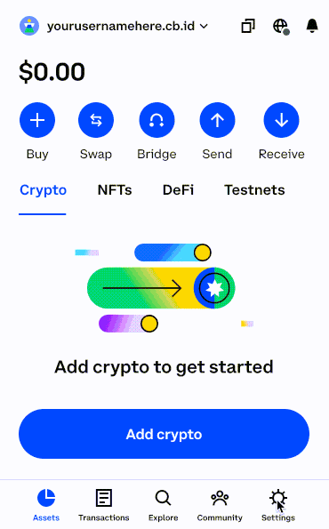

Developer settings provides additional features for development and managing your wallet, such as enabling test networks, viewing your private key, and other experimental features.



## Testnets

Enable and disable test networks.


To see a list of supported test networks, see [Whitelisted Networks](./whitelisted-networks.md).

:::info
Testnets are enabled by default for the Coinbase Wallet browser extension. When enabled, Testnet assets display separately from Mainnet assets in a dedicated Testnets tab.
:::

## Show private key

View the private key associated with your wallet.

:::info
If `Show Private Key` is disabled, you are connected to the extension through your mobile app or your hardware wallet.

To export your private key and get full functionality, first sign out of the extension and import your seed phrase into Coinbase Wallet Extension.
:::


:::caution

Do not share your private key with anyone, even Coinbase. Anyone with your private key can steal your funds.

:::

## Export custom networks

Exports all custom networks to your clipboard in JSON format.

```json
[
  {
    "id": "1337",
    "chainName": "localhost",
    "rpcUrls": ["http://127.0.0.1:8545"],
    "chainId": "1337",
    "nativeCurrency": {
      "decimals": 18,
      "name": "Custom network",
      "symbol": "TEST"
    },
    "blockExplorerUrls": [""],
    "iconUrls": [""]
  }
]
```

You can import custom networks under settings by navigating to **Default Network > Add custom network**
